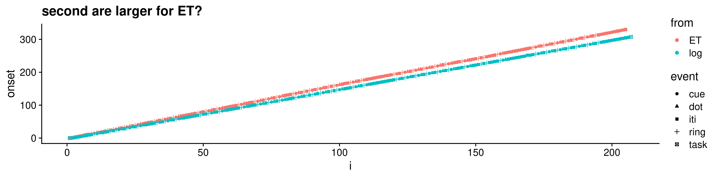
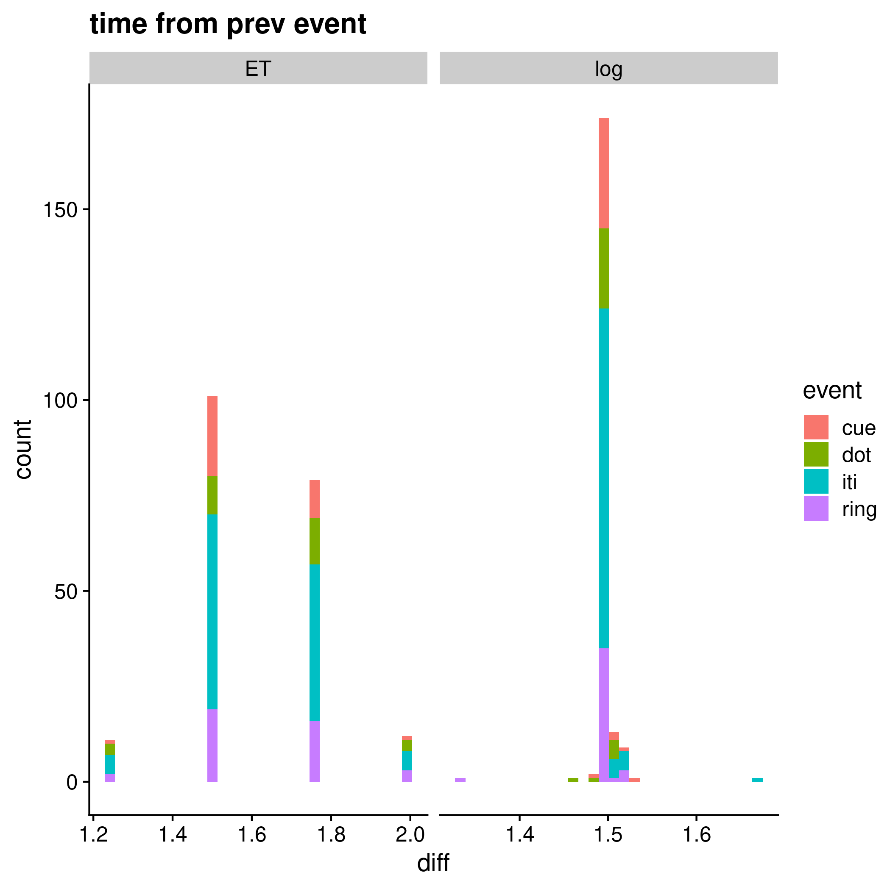
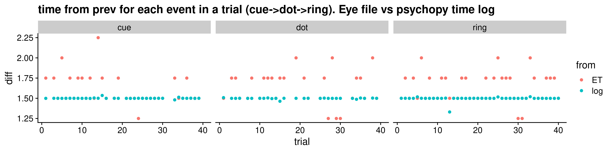

# Timing
## Task
Task has 3 events (Cue, Ring, Dot) and an inter-trial interval (ITI). Each event should last 1.5 seconds (TR locked).

## Logs
We have two time stamp logs of a run
  * "log" - window flip timing reported from psychopy 
  * "ET" - Eye Tracking output file marks/messages (lines starting with `12`)

## ET second vs Log
For the same run, the eye tracking log reports more time has passed!?

Is the numeric value in the mark line not time in seconds?

## Duration is variable in ET, more consistent in window flips/psychopy log
Is this an artifact of the eye tracking server or an issue with sending commands over a socket (instead of with DLL) with python?

Also illustrated w/duration (diff) of events per trial

